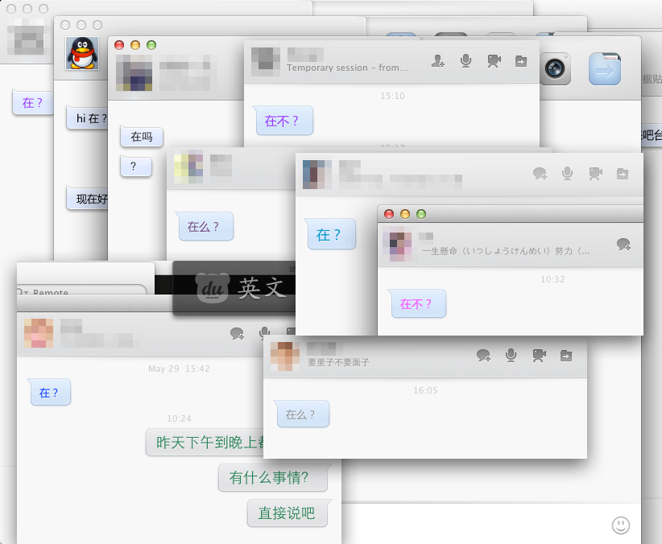

# 有效沟通

	刘：实例要讲清楚
	刘：具体的表现形式，演示中要有文子展示，让学员产生实际印象
	刘：how 需要具体
	刘：一种常规手法，可以先讲故事，注重学员的感受，然后再总结要点
	增加点有趣的东西
	

****

## 张颖

weibo: [@kael](http://weibo.com)


***

- 2009 年加入点评，最早的两个前端工程师之一
- 主站 + 团购
- 后来负责信息线前端团队
- 今年开始专心负责前端架构

***

1. 自己的经历
2. 有感而发
3. 希望能够跟大家分享经验

****

有哪些过程能够称之为沟通？

***

闲聊、人生座谈、沟通感情、

谈判、

开会、一对一谈工作


****

# 沟通的概念

> what ?

***

> 沟通是为了明确的 **目的**，
> 
> 人与人之间、人与群体之间
> 
> 信息、思想与感情的 **传达** 和 **反馈** 的过程，
> 
> 以求思想 **达成一致** 和感情的通畅。

***

### 要点

- 目的
- 传达 和 反馈
- 达成一致

***

### 本次课程的目的

让人与人直接沟通更顺畅，让沟通更有成效。

主要讲 `针对于和同事之间，职场上一对一的沟通`。

***

### Context

- 概念
- 沟通要素
- 沟通技巧

***

> HOW <-> WHY

|  

> 理解原理 <-> 死背公式


****

## 有成效的沟通

***

一个经典的游戏

***

为什么我们每个人会得到不同的结果 ？

***

- 说（传达）
- 听
- 问（反馈）

***

如果一个人说得太多...

***

一个人，从来不发表自己的意见...

***

> 有成效的沟通是双向的

****

# 如何做

> how ?

***

哪些问题，可能引起沟通失败 ？

***

- 三纸无驴
- 找错人了，踢皮球
- 说不清，道不明，听不懂
- 谈崩了，**伤感情**
- 利益冲突

***

**信息** 、_思想_、_与感情_

	这里可以稍微展开一下，具体说明有哪些感情。

****

## 选择合适的形式或媒介

***

面对面、
电话、
QQ、
书面（email，docs）

他们有什么不同 ?

***

- 文字
- 非文字
    - 语音语调
    - 肢体语言 
    
***

单纯的文字信息，传达说明性的信息是最精确的。

但非文字信息，会包含大量的其他信息，特别是情感。

***

如果条件允许，你会选择什么形式 ？

	分不同的场合和情况
	
	避免让学员有讲师在遍贬低其他沟通方式的感觉

****

## 确定沟通目的

1. 弄清楚自己的需求
2. 记录自己的问题
3. 模拟对方可能有的问题，事先准备

****

## 弄清楚沟通对象

***

<ol>
	<li class="fragment">如何确定与谁沟通</li>
	<li class="fragment">准备话题</li>
	<li class="fragment">准备应对的方式</li>
</ol>

——

##### 例子
- 面试者和面试官的例子
- 销售 team 的例子

****

## 如何有效传达

> 尽可能传达 **全面** 的信息

***

如何理解这里的 “**全面**” ?

***

1. 在信息的传递中，要包含完整的要素
2. 信息的完整与否是相对的，因对象和场合而异，需要灵活掌握
	- 双方的知识结构及深度的差异
	- 双方信息是否对称

***

图例

***


***

### 如何传达完整信息：信息 6 要素

> 如何讲故事？

***

六何法（5W1H）：

- What
- When
- Where
- Who
- Why
- How

***

倒金字塔

> 先讲重要的

***

### 技巧：慎用省略

除非双方孰知的东西，比如 “老地方见”。

“你懂的。” 对方真的懂了吗？

***

### 技巧：不要经由第三者转述

我们经常容易扮演这个 “第三者” 的角色。
除非万不得已，如果出现需要转述的情况，我们可以作为 “牵线人” 的角色。

	研究：超过两个人在传达，就要跳过中间者

****

## 聆听

***

# 聽

- 耳德
- 壬（九）耳十目一心，
- 十目一心耳听为王

***

需要一个志愿者上台

	两个游戏演完之后再讲概念
	
	两个场景的描述

***

前后两种场景，有什么不一样 ？

***

我们应当如何聆听 ?

***

### 要点

<ol>
	<li class="fragment">关注对方</li>
	<li class="fragment">配合对方的表情</li>
	<li class="fragment">避免做一些对方认为你是分心的举动</li>
	<li class="fragment">适时的表示赞许，并配合表情</li>
</ol>

****

## 回馈

***

1. 适当的复述对方的话
2. 不懂及时提问

***

## 聆听与回馈

图例：回馈与聆听的正向循环

****

## 先决条件是和谐的氛围

	还包括环境

1. 让大家畅所欲言
2. 感染对方
3. 避免过多地否定对方

	放到互动之后

****

## 达成一致

	王：补充点，在某些场合之下，这个阶段是提问的机会
	刘：达成一致具体要做什么
	

巩固 “达成一致” 的成果

- 如果是当面沟通，比如会议，需要一个总结
- 如果是邮件沟通，最后通过其他方式告知对方

***

1. 特别是书面沟通，一定需要有事后的跟进和确认
2. 重要的口头沟通，需要有书面总结


__

***

**例子1**

```
当年团购站上线的那一年，一个支付宝金账户合作的项目。
接口人发送了一个邮件抄送给相关的开发。
但是没有人回应，邮件就这样石沉大海。

这是一个典型的邮件沟通的例子。
上线的 deadline 当日，项目还没有开始。
结果整个团队加班到很晚才幸运地完成了上线。
```

***

**例子2**

```
去稍微有一些档次的地方吃饭，服务员都会跟我们确认菜单。
```
****

# 总结
1. 什么是沟通
	需要总结的时候再次强化，回顾要点，让学员自己说

2. 如何有效沟通，理解概念，

****

# Q & A
